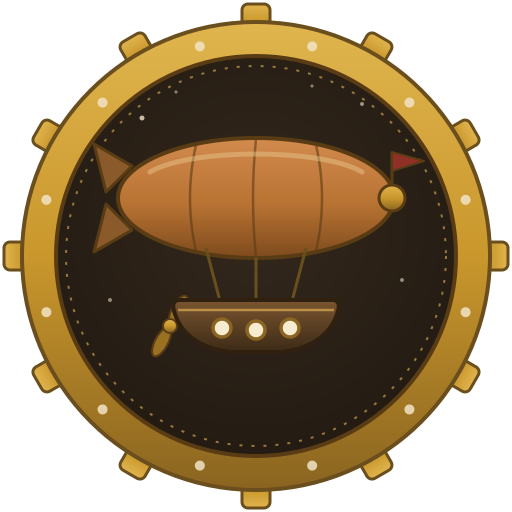
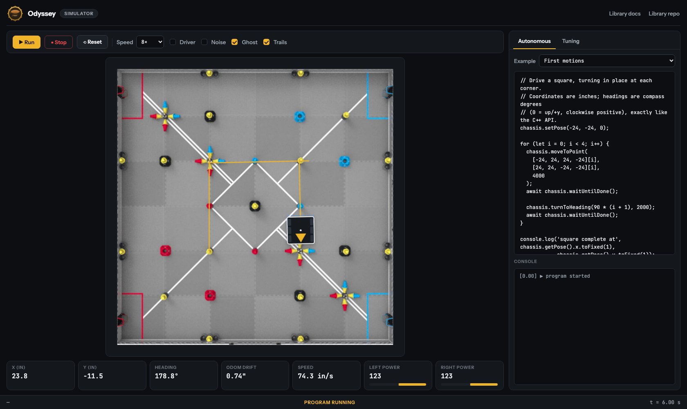

<p align="center">
  
</p>

<h1 align="center">Odyssey Simulator</h1>

<p align="center">
  A browser-based simulator for the
  <a href="https://github.com/jonahchang207/odyssey">Odyssey</a> VEX V5 odometry &amp;
  motion control library — write autonomous routines in the same API and watch them
  run on a virtual field, no robot required.
</p>

<p align="center">
  <a href="https://jonahchang207.github.io/odyssey/"></a>
  <a href="LICENSE"></a>
</p>



## What it is

The simulator runs a **line-for-line TypeScript port of the Odyssey C++ source** —
the same arc-based odometry, PID controllers, exit conditions, boomerang
`moveToPose`, swing turns, and pure pursuit — against a differential-drive
physics model, on the same 10 ms tick the PROS RTOS uses. Programs you
prototype here translate directly to the robot:

```js
chassis.setPose(-48, -48, 45);
chassis.moveToPose(0, 0, 90, 5000, { lead: 0.6 });
await chassis.waitUntilDone();
```

Same units (inches, compass degrees), same sign conventions, same motion
queueing (`waitUntil`, `waitUntilDone`, async motions), same tuning
parameters.

## Features

- **Field view** — the 12'×12' game field with the robot's true path (amber)
  and odometry's belief (dashed blue ghost + trail)
- **Code editor** — write autonomous routines against the `chassis` API;
  bundled examples cover every motion type
- **Tuning panel** — drivetrain geometry, lateral/angular PID, exit
  conditions, slew, tracking wheel layout — the same knobs as the library
- **Sensor noise** — toggle wheel slip and IMU drift to see how real
  odometry degrades, and how tracking-wheel setups compare
- **Driver control** — WASD / arrow keys through the library's arcade drive
- **Click-to-move** — click the field for instant `turnToPoint`,
  `moveToPoint`, and `moveToPose` targets
- **0.5×–8× simulation speed**

## Running it

Requires [Node.js](https://nodejs.org/) 20+.

```sh
npm install
npm run dev      # localhost dev server
```

Then open the printed `http://localhost:5173` URL.

Other commands:

```sh
npm run build    # type-check + production build to dist/
npm run preview  # serve the production build
npm test         # headless physics/motion regression checks
```

## How the simulation works

| Layer | What it does |
| --- | --- |
| `src/lib/` | Direct port of the Odyssey C++ library (odometry, PID, motions, pure pursuit) |
| `src/sim/` | 10 ms-tick scheduler standing in for the PROS RTOS, virtual V5 devices, differential-drive physics |
| `src/ui/` | Field renderer, editor, telemetry, tuning panels |

The physics feeds the virtual rotation sensors and IMU exactly what real
hardware would report (including centidegree quantization, and optional slip
and drift), and the ported library computes odometry and motor outputs from
those readings — so the "ghost" robot you see is genuinely what the
library believes, not a copy of ground truth.

## Part of the Odyssey project

- [Odyssey library](https://github.com/jonahchang207/odyssey) — the PROS template this simulates
- [Library documentation](https://jonahchang207.github.io/odyssey/) — installation, tuning guides, API reference

## License

MIT — see [LICENSE](LICENSE).
